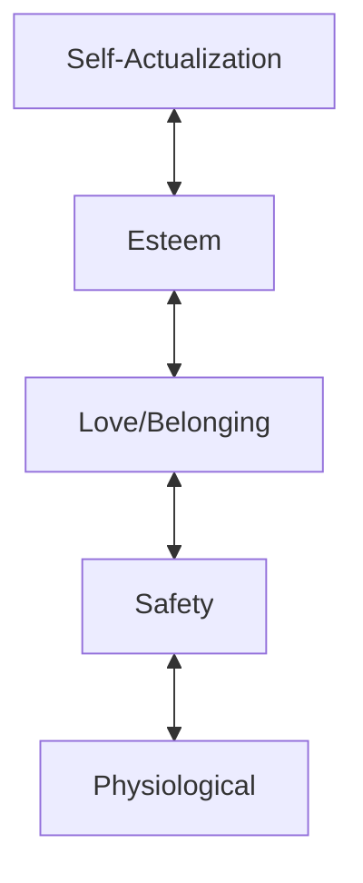

### Needs List

##### Physiological Needs

- Oxygen (breath)
- Food (starvation)
- Water (hydration)
- Shelter/Clothing (heat, exposure)
- Sex
- Sleep

##### Safety and Security

- Health
- Employment
- Property
- Family
- Sociability

##### Love and Belonging

- Friendship
- Family
- Intimacy
- Connection

##### Self Esteem

- Confidence
- Achievement
- Respect from others (status)
- [[Individuation|Individuation]]

##### Self Actualization

- Morality (codifying norms)
- Creativity
- Spontaneity
- Acceptance
- Purpose
- Meaning
- Feeling of Inner Potential

### Visuals

### Discussion

- Waterboarding (drowning) is such an effective torture because it attacks our most fundamental need, the base of the pillar. _Nothing_ else matters when you're drowning except oxygen.

### See Also

- [Maslow's Hierarchy of Needs](https://www.simplypsychology.org/maslow.html)
- [[./Deficiency Needs Vs Growth Needs|Deficiency Needs Vs Growth Needs]]
- [[Sex is a core need|Sex is a core need]]
