CHECK ALL PZs

This article will give you a working understanding of APIs and what they do. By the end, you'll be able to talk about them like you know what you're doing.

# In a Sentence

API stands for **Application Programming Interface**. 
It's a way to interact with the software without using the UI. 

It's often used by developers to _automate actions between tools_.

Example: PZ

1. What are APIs?
2. Creating a request
3. Understanding the response
4. Automatically sending requests
	1. How does Zapier fit into all this?

# Requests

>[!faq]- Why is it called a _RESTful_ API?
> REST stands for Representational State Transfer. 
> As in, you are requesting to **transfer** the **state** of whatever is **represented** on their servers.
> ---
> It's become the standard way of structuring most APIs, so when you see it, just think "a normal API".

Let's look at an example request.

```
GET /articles?include=author&fields[articles]=title,body,author&fields[people]=name
```

> What is going on here?

There are three parts to this:
- the word GET
- a path (`/articles`)
- a bunch of variables we're sending

## CRUD

When working with data, all actions fall into 4 essential types. The cool dudes in charge designated this with the acronym **CRUD**.
- **C**reate
- **R**ead
- **U**pdate
- **D**elete

Remember: the internet is basically made of crud. It's cruddy.

Rest APIs use slightly different names for these, but the actions are the same.
- PUT _(create)_
- GET _(read)_
- POST _(update)_
- DELETE

When sending an API call, you'll usually tell the system what kind of request this is.
- If I want to _get_ some info from the server, I send a GET request.
- If I want to _put_ in some new data, I send a PUT request.
- If I want to _post_ some changes to the existing data, I send a POST request.
Nobody's sure what a DELETE request does.

## Paths

Depending on what you're trying to do, the path your request takes will change.

Many software tools have an API, but they don't always let you do everything you can do using the UI, so it's useful to check their documentation before promising anything.

For example, the ClickUp API (PZ) can let you create and update tasks, but you can't make changes to a whiteboard. [^1]
[^1]: At least at time of writing 2023-04-08.

## Variables

PZ

# Responses

What do we actually get? Our JSON response will look something like this.

```json
{
  "tasks": [
    {
      "id": "9hx",
      "name": "New Task Name",
      "status": {
        "status": "To Do",
        "color": "#d3d3d3",
        "orderindex": 0,
        "type": "open"
      },
      "date_created": "1567780450202",
      "date_updated": "1567780450202",
      "list": {
        "id": "123"
      },
      "folder": {
        "id": "456"
      },
      "space": {
        "id": "789"
      },
      "url": "https://app.clickup.com/t/9hx"
    },
    {
      "id": "9hz",
      "name": "Second task",
      ...
  ]
}
```

Once we get our head around the structure, it's actually pretty easy to read. What we're seeing here is a bunch of value objects, each of which has fields that can have their own values and so on - creating these _Russian nesting doll_ type structures.


>[!faq]- JSON?
>JSON stands for **JavaScript Object Notation** (although it works in plenty of languages, not just Javascript).
>It's the same kind of thing as **XML** or **YAML** if anyone asks, just a way of structuring data like this with names, parents and children.

Each pair of things is separated by a colon and represents a field and a value.
`field : value`

`"name" : "Bob"`
`"Age" : 40`

```json
"name": "New Task Name"
// the task's name is "New Task Name"
```

Sometimes we need to represent multiple values for one field. So, we wrap it in brackets. Since everything in JSON follows the `field : value` pattern, they have field names as well as values.

`"Friends" : {"friend1" : "Tim", "friend2" : "Jane"}`

To make this more readable, we bring each value down to it's own line and indent a bit.
In other words, each level of indentation indicates that this value is a child of the thing above it.

```JSON
"status": {
	"status": "To Do",
	"color": "#d3d3d3",
	"orderindex": 0,
	"type": "open"
  },
"date_created": "1567780450202",
//The "status" field has 4 values, each of which is indented.
//"date_created" isn't its child, so we go back.
```

> [!faq]- Why are the timestamps like that?
> Sometimes APIs will return dates as a big number (_1567780450202_) instead of a human readable date (_Friday, September 6, 2019_). 
> ---
> These are called **UNIX Timestamps** and represent the number of seconds since Jan 1st 1970 (when the universe began). 
> There are [websites](https://www.epochconverter.com/) and functions in most coding languages to convert these to something more human readable.

To reference a value, we call its name.

If we want one of those child values, we just call it by it's full name, `parent.child`. Each `.` means we're going down a level.

For example, if I asked for "status", I'd get that list of 4 values.
But if I asked for "status.type", I'd get "open".

This can sometimes look odd, like having to ask for "status.status" to get the value we want ("To Do"), but it clears up a lot of ambiguity.

> [!faq]- Will this work in Python/Javascript/[etc]? 
> **Yes**. Every modern language has ways of connecting to the internet and handling data, which means they can use APIs. The client and server don't even need to be using the same language as long as they format their messages to each other in a standard RESTful way.

# Automating Actions

Lets say I want to have Zoom automatically update my Slack status to show as busy when I'm in a call.

>1. When my Zoom meeting starts, update my Slack status to "In a meeting"
>2. When my Zoom meeting ends, update my Slack status to "Free"

To do this, I need Zoom to let me know when this happens, and send an API request to Slack to change my status.

```mermaid 
sequenceDiagram

    Zoom-->>My Server:Meeting Started

    My Server->>Slack: /POST, Set status to "Busy"

    Zoom-->>My Server: Meeting Ended

    My Server->>Slack: /POST, Set status to "Available"
```



For this to work, we need Zoom to automatically let us know something happened. In other words, **we need Zoom to start the conversation**.

**Webhooks** are a way to subscribe to be notified about changes.
Zoom has webhooks that let us subscribe to updates about our meeting status. 

Once our server subscribes, Zoom will let us know when a meeting starts and ends. From there, we just write some code to update our Slack status whenever we get a message from Zoom.

## Zapier

Zapier is an integration tool that people commonly use to connect tools.
Under the hood, Zapier is just using APIs and Webhooks like everybody else, but they take the hassle out of setting up your server, subscribing to webhooks, writing code to take actions, etc. 

Again, **Zapier doesn't do anything you couldn't do yourself with an API**, they just make it easier.

>[!faq]- iPaSS?
>ipass stands for PZ,
>it's the class of software that Zapier, Make, Workato and others are in.
>They take the hassle out of writing code and hosting a server to deal with APIs and Webhooks by providing drag & drop websites.
>---
>If a piece of software doesn't have an API, they probably wont work with these tools either (unless they worked out a special deal with them to provide exclusive access)

When Zapier has an "Instant Zap" trigger, that's just their brand name for a webhook. 
If the software doesn't offer a webhook for Zapier to subscribe to, this is where they offer those "check every 15 minutes for changes" triggers, which is just them calling a GET request every 15 minutes and seeing if the data looks any different than it did before.

PZ image of zapier triggers

### Summary

TLAs:
- API
- CRUD
- JSON
- Pagination
- REST ("a REST API")

### See Also

- 
