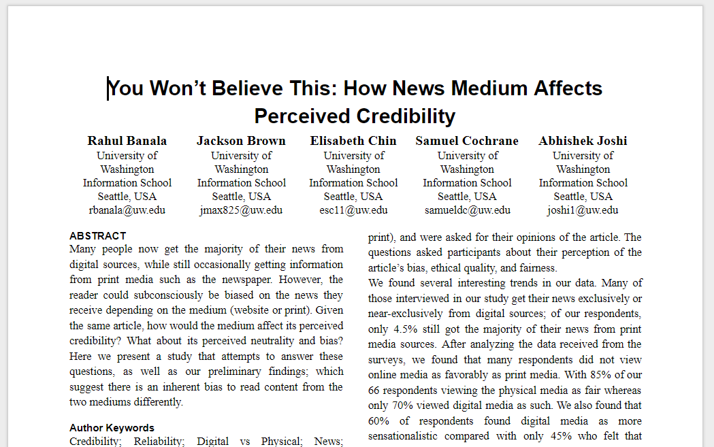
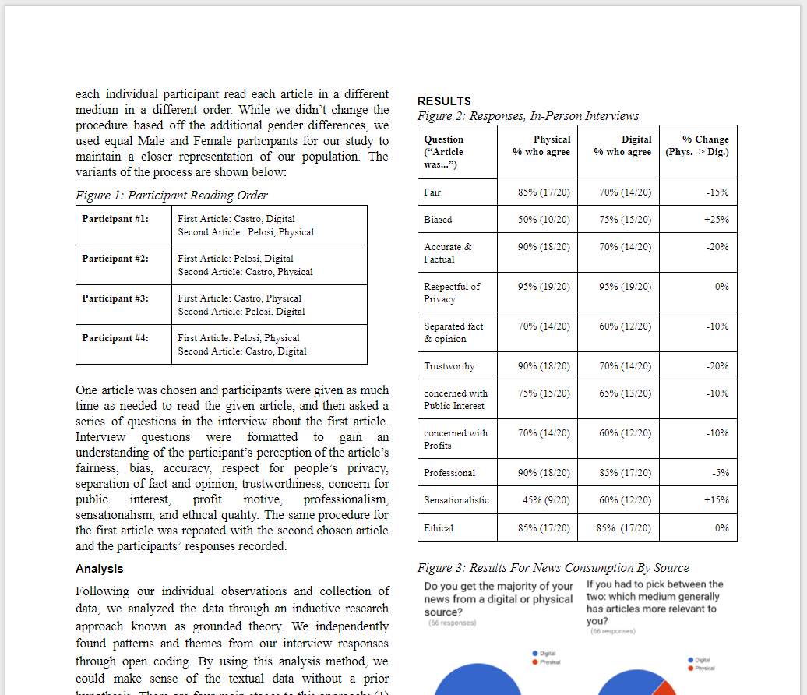

<small>Designed & executed a small study to determine the trustworthiness bias of print & digital media, wrote a whitepaper detailing our findings.</small>

As a final project for _INFO 470, Research Methods in Informatics_, a team and I were tasked with conducting a real-world research project on a topic of our choosing.
We chose to examine the perceived differences between print and digital news. 

When asked to rate an article on 11 dimensions of credibility (bias, professionalism, accuracy), we sought to understand how would their responses change.

> [!info] Our question: would an article's _medium_ (print vs web) alter its perceived _biased_ and _trustworthiness_ 
> If we could discover a common difference in these responses, we could uncover an inherent bias (regardless of actual content) for/against a certain medium.

To accomplish this, we developed a small interview script where we had participants read an article on either a print or digital source (newspaper, laptop), rate the article on the aforementioned dimensions, and then read another article in the other medium.
Each article was available in both mediums. It was key that each article we tested was available in print (e.g. in the newspaper) and digital (e.g. on that newspaper's website), so that we could evaluate the differences in these perceived value for the exact same content.
While our study did not interview enough people to reach statistical significance (this project was unfunded and more to demonstrate our understanding of study design), what data we produced did return a strong correlation towards inherent differences in perception of the articles.

We found that on average about 20% fewer of the respondents considered the same article trustworthy, accurate, and factual when the article was moved from a printed to a digital format, and likewise **we discovered a 25% increase in the number of respondents who considered the article biased when moved from physical to digital**.

This data would suggest a **_strong and inherent bias_** to consider news content found online less trustworthy and more biased than news content found in a physical format.

---

The full report is available online [here.](https://docs.google.com/document/d/1-bUlfE2dtuZtueVD4oufMzspPFEXpTULfBxOhiiIR2Q/edit?usp=sharing)
If you'd like to see additional documents, such as our survey questions, R data, or rough drafts, they are available [here.](https://drive.google.com/drive/folders/0B8L_EIH2PrGWYTE4MGdlcEhTVm8?usp=sharing)
