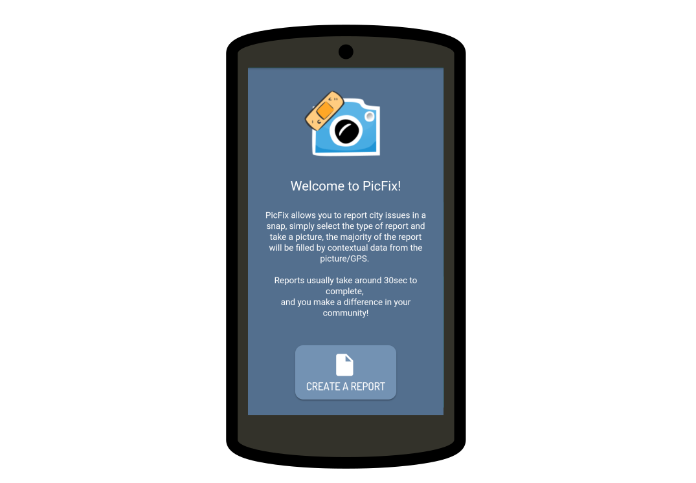

An app to modernize the 311 service request system. Informatics Capstone Project.

---

The 311 Service Request system is a powerful, but rarely used, government service (similar to 911 or 411) that users can call to report civic issues such as graffiti, broken glass, or downed power lines.  
Over the course of two quarters, a teammate and I designed a fully functional iPhone/Android application that leverages the capabilities of modern smartphones to make reports quicker and easier.

The application uses computer vision technology to automatically fill out much of the information necessary for a report. In the example video above, the license plate & car information is grabbed automatically out of the picture. This design is not only faster and easier than describing issues over the phone, it provides more useful information to the city government.

User-crafted reports are structured into a JSON document and pushed to a Firebase DB, where they can be accessed and queried from later, making the app 'fully functional' (if a city government were monitoring the requests).

---

While the project is no longer in active development, all project files and resources are available on [Github]([https://github.com/SamuelCochrane/PicFix](https://github.com/SamuelCochrane/PicFix)), and can be viewed along with an explainer video.
