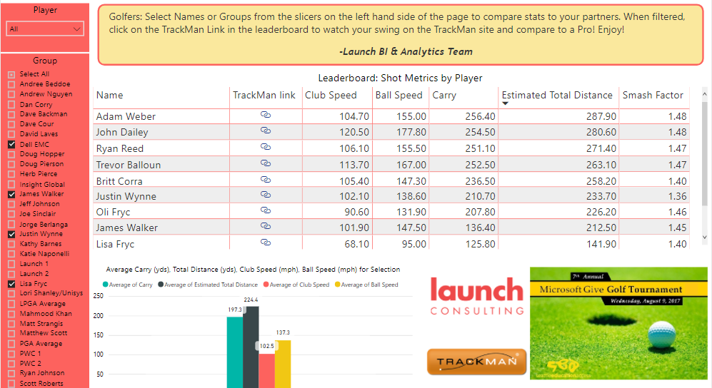

<small>Designed & built an interactive dashboard for a golf tourney. Allows golfers to see their stats & compare against the other golfers.
Built using PowerBI for the MSIT Give Golf Tournament.</small>

---

Launch Consulting would be sponsoring one of the holes for the annual MSIT Give Golf Tournament, an event Microsoft hosts for charity, and Launch wanted to do something unique. They partnered with [Trackman](https://trackmangolf.com/), a company that designs hardware that can track golf swing data.

These devices are usually used by pro golfers to do complex analysis on their swings, but here every golfer that came by the hole 16 would be able to see their swing data for free.

This dashboard was designed to let the golfers view their swing data (ball speed, distance, etc) after the tournament, and compare how they & their team did to others.

This was a big hit at the tournament, and many couldn't wait to get online after it ended to start bragging to their coworkers about how they _"hit the ball 20MPH faster than James in accounting"_ (or at least something along those lines).

---

The dashboard ~~is~~ was available at [http://launchcg.com/golf](https://launchcg.com/golf/), and ~~can~~ could be viewed along with a well-produced video & some other jump-out statistics produced by other members of the team.
